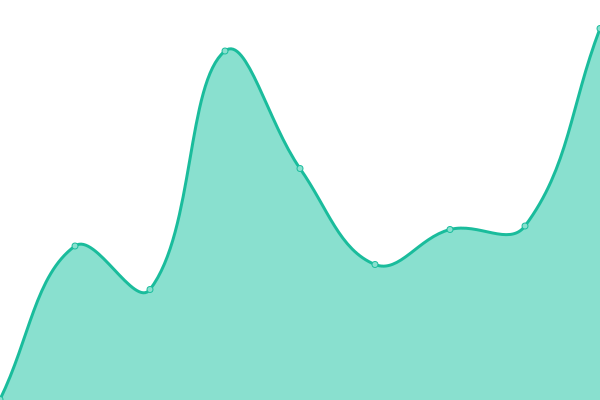

# <!--live status--> **🟩 All systems operational**

[**Status website →**](https://Okkido.github.io/status)

<!--start: status pages-->
<!-- This summary is generated by Upptime (https://github.com/upptime/upptime) -->
<!-- Do not edit this manually, your changes will be overwritten -->

| URL                                                              | Status | History                                                                                                                | Response Time                                                                                  | Uptime                                                                                                                                                                                                                                         |
| ---------------------------------------------------------------- | ------ | ---------------------------------------------------------------------------------------------------------------------- | ---------------------------------------------------------------------------------------------- | ---------------------------------------------------------------------------------------------------------------------------------------------------------------------------------------------------------------------------------------------- |
| [Antonius](https://www.antonius.me)                              | 🟩 Up  | [antonius.yml](https://github.com/Okkido/status/commits/master/history/antonius.yml)                                   |  494ms                  |                                    |
| [Phonetic](https://phonetic.xyz)                                 | 🟩 Up  | [phonetic.yml](https://github.com/Okkido/status/commits/master/history/phonetic.yml)                                   |  279ms                  |                                    |
| [Church of Procrastination](https://churchofprocrastination.com) | 🟩 Up  | [church-of-procrastination.yml](https://github.com/Okkido/status/commits/master/history/church-of-procrastination.yml) |  285ms |  |
| [Varldens basta chili](https://varldensbastachili.se)            | 🟩 Up  | [varldens-basta-chili.yml](https://github.com/Okkido/status/commits/master/history/varldens-basta-chili.yml)           |  391ms      |            |

<!--end: status pages-->

---

