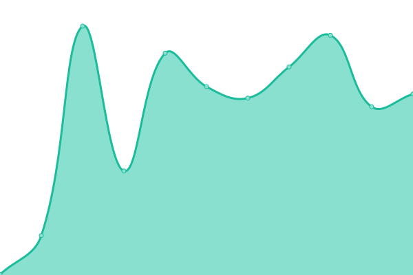
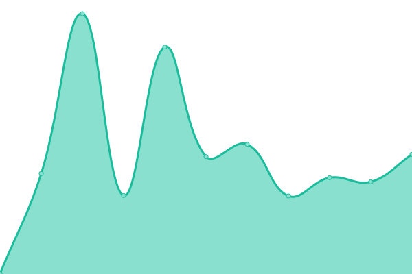
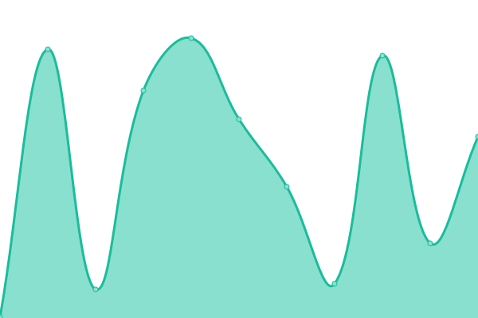

# [📈 Live Status](https://Okkido.github.io/status): <!--live status--> **🟩 All systems operational**

This repository contains the open-source uptime monitor and status page for [Peter Antonius](http://antonius.me/), powered by [Upptime](https://github.com/upptime/upptime).

With [Upptime](https://upptime.js.org), you can get your own unlimited and free uptime monitor and status page, powered entirely by a GitHub repository. We use [Issues](https://github.com/Okkido/status/issues) as incident reports, [Actions](https://github.com/Okkido/status/actions) as uptime monitors, and [Pages](https://Okkido.github.io/status) for the status page.

<!--start: status pages-->
<!-- This summary is generated by Upptime (https://github.com/upptime/upptime) -->
<!-- Do not edit this manually, your changes will be overwritten -->

| URL                                                              | Status | History                                                                                                                | Response Time                                                                                  | Uptime                                                                                                                                                                                                                                         |
| ---------------------------------------------------------------- | ------ | ---------------------------------------------------------------------------------------------------------------------- | ---------------------------------------------------------------------------------------------- | ---------------------------------------------------------------------------------------------------------------------------------------------------------------------------------------------------------------------------------------------- |
| [Antonius](https://www.antonius.me)                              | 🟩 Up  | [antonius.yml](https://github.com/Okkido/status/commits/master/history/antonius.yml)                                   |  598ms                  |                                    |
| [Phonetic](https://phonetic.xyz)                                 | 🟩 Up  | [phonetic.yml](https://github.com/Okkido/status/commits/master/history/phonetic.yml)                                   |  281ms                  |                                    |
| [Church of Procrastination](https://churchofprocrastination.com) | 🟩 Up  | [church-of-procrastination.yml](https://github.com/Okkido/status/commits/master/history/church-of-procrastination.yml) |  991ms |  |
| [Världens bästa chili](https://varldensbastachili.se)            | 🟩 Up  | [vaerldens-baesta-chili.yml](https://github.com/Okkido/status/commits/master/history/vaerldens-baesta-chili.yml)       |  368ms    |        |

<!--end: status pages-->

[**Visit our status website →**](https://Okkido.github.io/status)

## 📄 License

- Code: [MIT](./LICENSE) © [Peter Antonius](http://antonius.me/)
- Data in the `./history` directory: [Open Database License](https://opendatacommons.org/licenses/odbl/1-0/)
