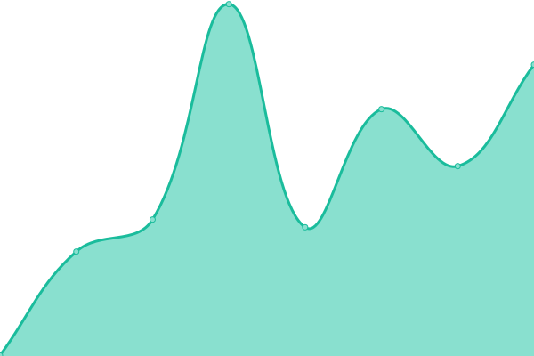
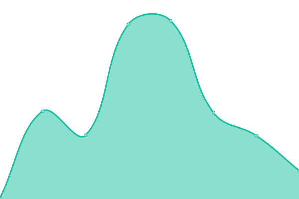
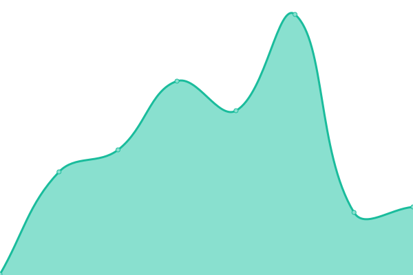
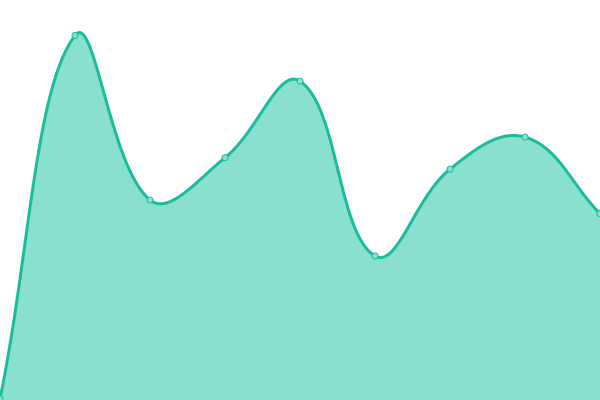

# <!--live status--> **🟩 All systems operational**

[**Status website →**](https://Okkido.github.io/status)

<!--start: status pages-->
<!-- This summary is generated by Upptime (https://github.com/upptime/upptime) -->
<!-- Do not edit this manually, your changes will be overwritten -->
<!-- prettier-ignore -->
| URL | Status | History | Response Time | Uptime |
| --- | ------ | ------- | ------------- | ------ |
|  [Antonius](https://www.antonius.me) | 🟩 Up | [antonius.yml](https://github.com/Okkido/status/commits/master/history/antonius.yml) | 

 354ms
     
 | 

<a href="https://Okkido.github.io/status/history/antonius">100.00%</a>
    

|  [Phonetic](https://phonetic.xyz) | 🟩 Up | [phonetic.yml](https://github.com/Okkido/status/commits/master/history/phonetic.yml) | 

 234ms
     
 | 

<a href="https://Okkido.github.io/status/history/phonetic">100.00%</a>
    

|  [Church of Procrastination](https://churchofprocrastination.com) | 🟩 Up | [church-of-procrastination.yml](https://github.com/Okkido/status/commits/master/history/church-of-procrastination.yml) | 

 187ms
     
 | 

<a href="https://Okkido.github.io/status/history/church-of-procrastination">100.00%</a>
    

|  [Varldens basta chili](https://varldensbastachili.se) | 🟩 Up | [varldens-basta-chili.yml](https://github.com/Okkido/status/commits/master/history/varldens-basta-chili.yml) | 

 267ms
     
 | 

<a href="https://Okkido.github.io/status/history/varldens-basta-chili">99.86%</a>
    

<!--end: status pages-->

---

